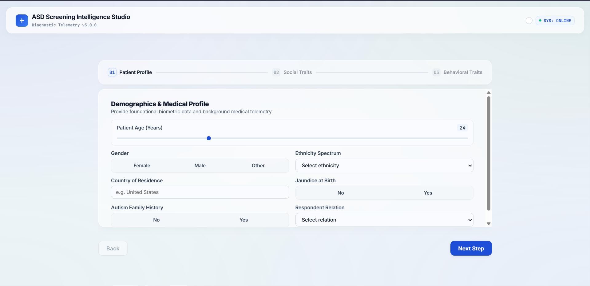
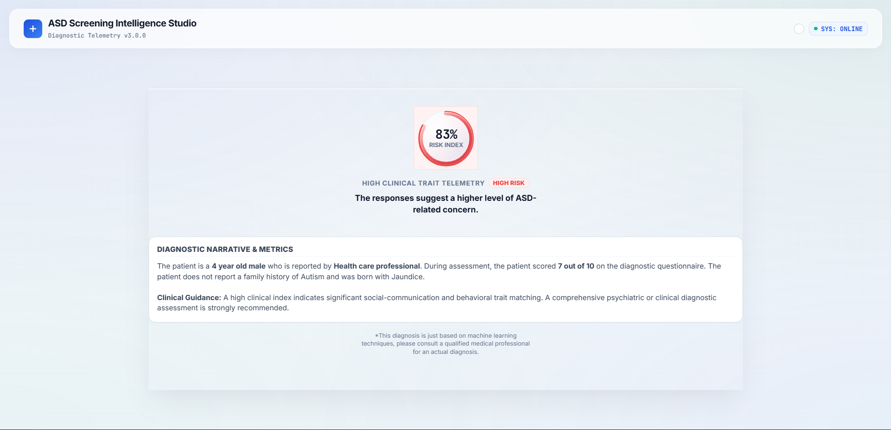
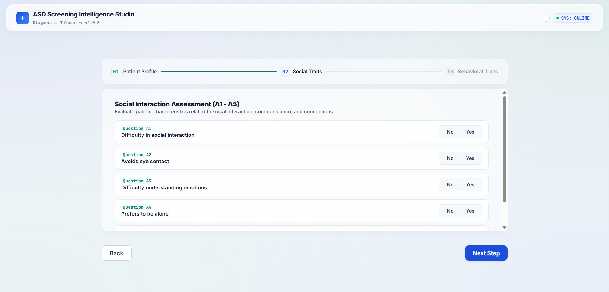
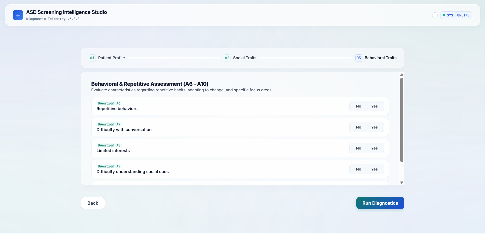
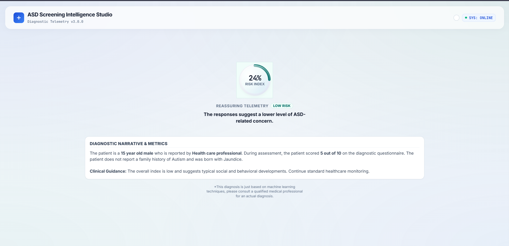

# ASD Screening Intelligence Studio

A robust, experimental engineering platform designed for autism spectrum disorder (ASD) risk screening using advanced machine learning architectures and fuzzy logic inference.

This project was built as an engineering case study to explore how traditional machine learning (Random Forest) can be augmented with expert systems (Fuzzy Logic) to produce a highly accurate, interpretable **Hybrid ML** model. The application features a high-fidelity, 3D unified clinical UI designed to process and present telemetry clearly.

📚 **Read the Full Research Paper:** [ASD Screening Intelligence Research Document](https://docs.google.com/document/d/1KBcMBTBntDNorLW_KFBbVYU9PQL3Lvit/edit?usp=drive_link&ouid=117330977789940588096&rtpof=true&sd=true)

> **Note for Evaluators:** This software is a proof-of-concept engineering research project. It is **not** an FDA-approved medical diagnostic tool and should not be used for actual clinical diagnosis.

---

## 🚀 Engineering Features & Architecture

### 1. The Machine Learning Engine (Backend)
- **Baseline Model:** A conventional Random Forest Classifier trained on clinical screening data.
- **Fuzzy Inference System:** A rule-based logic system evaluating continuous degrees of membership for social and behavioral traits rather than rigid binary splits.
- **Hybrid Model (The Core Engine):** A state-of-the-art classifier that combines original dataset features with the generated fuzzy scores (e.g., `fuzzy_symptom`, `fuzzy_social`) to dramatically boost accuracy and model interpretability.

### 2. The 3D UI/UX (Frontend)
- **Unified Diagnostic Console:** A seamless, single-flow user experience built with HTML, CSS, and Vanilla JS.
- **State Machine UI:** Transitions smoothly from a stepped clinical wizard into a dynamic, hardware-accelerated 3D scanning animation, culminating in a single unified "ASD Risk Index."
- **Premium Aesthetics:** Zero-scroll design, clinical glassmorphic teals/cyans, and interactive 3D card tilts using CSS perspective and Javascript mouse-tracking.

---

## 🧠 System Architecture

The project relies on a deeply integrated **Hybrid Expert-ML Architecture**, bridging the gap between traditional machine learning and clinical logic rules.

1. **Data Ingestion & Preprocessing:** The system consumes a 10-question behavioral survey alongside patient biometrics. These raw inputs (`A1_Score` to `A10_Score`) are passed concurrently into two pipelines.
2. **Fuzzy Logic Expert System (The Rule Engine):** Instead of binary decision boundaries, the system uses a **Mamdani Fuzzy Inference System**. Raw scores are mapped into continuous membership degrees (e.g., *Mild*, *Moderate*, *Severe*). A set of clinical rules evaluates the interaction between social traits and repetitive behaviors, outputting a continuous `Fuzzy_Score` that represents the clinical expert's modeled intuition.
3. **Hybrid Random Forest Classifier (The ML Engine):** The final decision is not made by the fuzzy system alone. Instead, the `Fuzzy_Score` is concatenated with the original raw features to create an enriched **Hybrid Feature Space**. A Random Forest Classifier is trained on this enriched dataset. By providing the ML model with human-like clinical reasoning features, the model achieves higher accuracy and drastically reduces false positives compared to the baseline model.

---

## 📸 Application Interface

Here is a preview of the unified 3D application workflow:

| Patient Profile | Social Traits | Behavioral Traits |
| :---: | :---: | :---: |
|  |  |  |

| Low Risk Telemetry | High Risk Telemetry |
| :---: | :---: |
|  |  |

*(Note: Please ensure the images provided are saved in an `images/` directory at the root of the repository with the filenames listed above for them to display correctly).*

---

## 📂 Project Structure

```text
ASD-Detection/
├── backend/
│   └── main.py              # FastAPI server & inference endpoints
├── frontend/
│   ├── index.html           # Unified 3D Workspace UI
│   ├── style.css            # Hardware-accelerated CSS & Theme
│   └── script.js            # State machine & API integration
├── model/
│   ├── train_model.py       # ML Pipeline for training Baseline & Hybrid models
│   ├── fuzzy_logic.py       # Fuzzy logic rule sets and membership functions
│   └── hybrid_features.py   # Feature engineering bridge for the hybrid model
├── requirements.txt         # Python dependencies
└── README.md
```

---

## 🛠️ Setup & Deployment

### 1. Environment Setup
Clone the repository and install the required dependencies using a virtual environment.

```bash
# Create and activate virtual environment
python -m venv venv
venv\Scripts\activate      # On Windows
# source venv/bin/activate # On Unix/MacOS

# Install dependencies
pip install -r requirements.txt
```

### 2. Model Training (Optional)
If you need to retrain the Random Forest and Hybrid models from the dataset:

```bash
python -m model.train_model
```
*Note: The system preserves original dataset spelling idiosyncrasies (e.g., `jundice`, `contry_of_res`) to ensure alignment between training features and inference.*

### 3. Running the Application
Start the FastAPI server (which also serves the static frontend UI):

```bash
python -m uvicorn backend.main:app --reload --port 8000
```

Access the application in your browser at: **`http://127.0.0.1:8000/app/`** (or just load `/frontend/index.html` directly).

---

## 📡 API Reference

- **`GET /health`**
  Returns model metadata, accuracy metrics, and system status.
- **`POST /predict`**
  Accepts a JSON payload containing the 10-question screening responses and biometric data, returning the unified risk analysis (using the hybrid model's prediction).

---

## 🔍 Future Optimizations
- **Data Expansion:** Implement stricter cross-validation with external clinical datasets.
- **Explainable AI (XAI):** Integrate SHAP values into the final 3D UI to show the user exactly *why* the hybrid model made its prediction.
